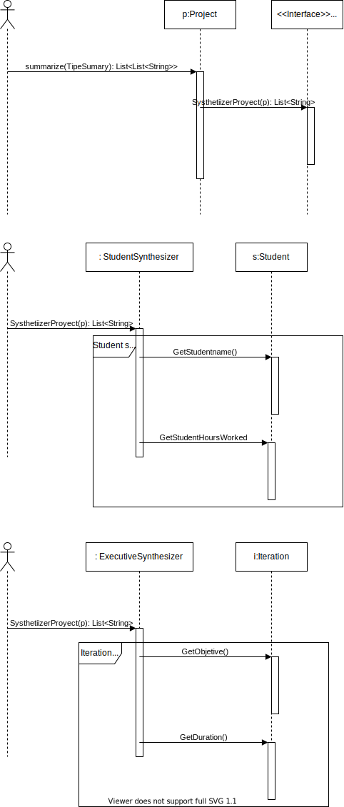
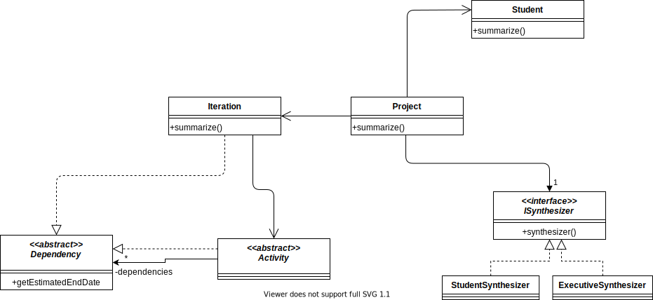

 # POOB-TEST-FIRST-SABANA-RESEARCH PARCIAL 1

 ## Diagrama de Memoria

 Mirar archivo pdf Mapa de memoria
 

 ## Diagrama UML

 

 ## Diseño
 

 ### Conceptos

 1. ¿Qué es encapsulamiento? ¿Qué ventajas ofrece?

Es cuando se limita el acceso a alguna variable en alguna clase con el fin de tener un mayor control sobre ella, evitando la modificación de un tercero.

Permite construir estructuras mas complicadas, permite relacionarlas y a su vez da una mejor capacidad de reutilización del código.

2. ¿Qué es ocultación de información? ¿Por qué aplicarla? ¿Cómo se implementa en Java?

Se refiere a que, en un objeto, sus atributos privados pueden ser únicamente modificados u obtenidos a través de la invocación de métodos.

Para ocultar el diseño de almacenamiento físico de los datos, haciendo esto te aseguras de que si algún diseño fuese modificado, afecte únicamente a un subconjunto del programa total. La ocultación es implementada en java a través de los modificadores de acceso.

 # Parcial # 2

 # DISEÑANDO

/**
Gerera un tipo de resumen dependiendo del tipo de resmuen

return El resumen dependientod del TipeOfSummary
param TipeOfSummary
*/

 Public List<List<String>> sumarize(String TipeOfSummary)

 

 

 # EXTENDIENDO

 

 De los diseños resultantes del punto I y II, ¿Qué debe cambiar? ¿Qué no debe cambiar?

 Debe cabiar las relaciones existenente s entre una actividad y una interacion, sim embargo no se debe modificar la estrcutura de estas clase, ya que se debe usar otra clase que me permita identificar la dependencia nesesario de la actividad

 Teniendo en cuenta los cambios necesarios ¿Que fue bueno y que fue malo de su diseño?

 Lo bueno de los diseños anteriores fue que ya estaban estructurados de una forma que para generar dependencia de otras clases o de la misma, no era necesario realizar muchos cambios, por lo cual solo requirió crear un a clase abstracta que nos permitiera esta, sim embargo lo malo fue que esto provoco demasiadas denuncias a la clase dependency entonces si algo le ocurre a la clase las actividades no funcionarían.

 # CONCEPTOS

1. ¿Cuáles son las acciones los tres momentos importantes de las excepciones? ¿Cuál es el objetivo de cada una? ¿Cómo se implementa en Java cada acción?.

Throw, Avisa al usuario que se esta cometiendo un error que no esta teniendo en cuenta,public void Algo() throws Exception
Propagar, controlar la excepcion,public void Algo() throws Exception
Atrapar, con el fin de dejar de arrojar la excepcion, try { Algo() } catch(Exception e) {}

2. ¿Qué es sobre-escritura de métodos? ¿Por qué aplicarla? ¿Cómo impedir que se sobre-escriba un método?.

Una sobre-escritura de metodos es cuando otra clase reescribe un metodo existente con el fin de cambiar su comportamiento. Para impedirlo debes poner el metodo final. se utiliza por medio de @Overwrite y abajo el metodo.

 # EVIDENCIA SONARQUBE

 
